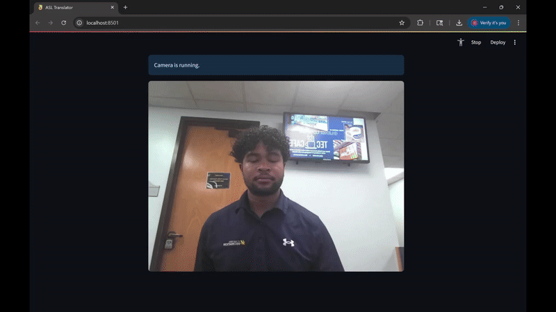

# ASL Alphabet Computer Vision 🤟

A deployable machine learning and computer vision project that interprets the ASL alphabet from the user and displays the predicted letter in real time.

## ✨ Highlights
- Built with **TensorFlow**, **MediaPipe**, and **OpenCV**
- Robust **hand detection** and clean **letter labeling**
- Solid baseline **accuracy** on held-out data (add your %)

## 🧱 Tech Stack
- Python • TensorFlow/Keras • MediaPipe • OpenCV • Streamlit

## 📊 Results (quick)
- Accuracy: **91% test**
- Notes: ROI cropping + MediaPipe landmarks improved stability

## 🧠 How It Works (overview)
- **MediaPipe** locates the hand and creates a bounding box
- Cropped hand images are **preprocessed** (224×224, normalized)
- A **CNN classifier** predicts the ASL letter (A–Z)

## 🛣️ Roadmap
- Export TFLite and measure CPU latency
- Improve noisy background robustness
- Improve low-light robustness
- Expand to dynamic signs (words)

---
Created by **Nathan Grant**
